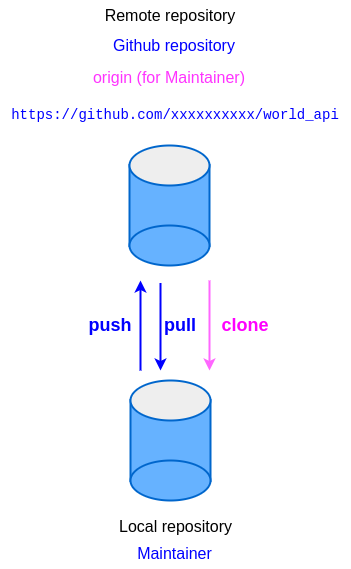

# Task 3_1

## Tasks for Maintainer

### Overview of repositories for team members

<figure style="text-align: center">
   
   <figcaption>Repositories overview</figcaption>
</figure>

### Prepare a local repository

1. Open `Git Bash`.
2. From your cloned repo, extract the file **`world_api.zip`** into a directory (**outside this repository**), e.g. **`/d/working`**. Then change into the directory.

   **RUN:**

   ```console
   cd /d/working
   unzip world_api.zip
   cd world_api
   ```

3. Check that you have the correct directory. There should be 3 files, **`main.py`**.

   **RUN:**

   ```console
   ls -a
   ```

   **OUTPUT:**

   ```console
   .  ..  .gitattributes  .gitignore  main.py
   ```

4. Initialise the directory as a Git repository.

   **RUN:**

   ```console
   git init
   ```

5. Add all 3 files and create the first commit for this repository

   **RUN:**

   ```console
   git add main.py .gitignore .gitattributes
   git commit -m "Initial commit"
   ```

### Create a repository on GitHub

1. With your account on GitHub, create a new repository named **`world_api`**.

2. For example, for a **maintainer** with username **`xxxxxxxxxx`**:

   Your new repository should be: **`https://github.com/xxxxxxxxxx/world_api`**

   This repository will be used as **maintainer**'s remote **`origin`**.

### Add local commit to **`origin`**

1. Go to the directory **`world_api`** on you local machine.

   **RUN:**

   ```console
   cd /d/working/world_api
   ```

2. Add a reference to remote repository on GitHub.

   The remote repository on GitHub **`world_api`** will be called **`origin`**.

   **RUN:**

   ```console
   git remote add origin https://github.com/xxxxxxxxxx/world_api.git
   ```

   The above command adds a reference to the remote repository using name **`origin`**.

3. Push local commit(s) to the remote repository.

   **RUN:**

   ```console
   git push -u origin main
   ```

   **OUTPUT:**

   ```console
   Enumerating objects: 5, done.
   Counting objects: 100% (5/5), done.
   Delta compression using up to 4 threads
   Compressing objects: 100% (5/5), done.
   Writing objects: 100% (5/5), 3.45 KiB | 272.00 KiB/s, done.
   Total 5 (delta 0), reused 0 (delta 0), pack-reused 0
   To https://github.com/xxxxxxxxxx/world_api.git
    * [new branch]        main -> main
   branch 'main' set up to track 'origin/main'.
   ```

   **NOTE:**

   - `push` command pushes local commit(s) on current branch (`main`) to remote repository using reference **`origin`** on branch `main`
   - option `-u` sets this local branch to also track the remote branch
   - the branch **`main`** on **`origin`** is a **remote branch**.
   - the branch **origin/main** on local repo is a **remote tracking branch**

4. Check current local branches.

   **RUN:**

   ```console
   git branch
   ```

   **OUTPUT:**

   ```console
   * main
   ```

5. Check current all branches (local and remote branches).

   **RUN:**

   ```console
   git branch -a
   ```

   **OUTPUT:**

   ```console
   * main
     remotes/origin/main
   ```

   **NOTE:**

   - option `-a` lists both remote-tracking and local branches

6. Check current all branches (local and remote branches) with more information.

   **RUN:**

   ```console
   git branch -av
   ```

   **OUTPUT:**

   ```console
   * main                0ced441a Initial commit
     remotes/origin/main 0ced441a Initial commit
   ```

7. Check current all branches (local and remote branches) with more details.

   **RUN:**

   ```console
   git branch -avv
   ```

   **OUTPUT:**

   ```console
   * main                0ced441a [origin/main] Initial commit
     remotes/origin/main 0ced441a Initial commit
   ```

   **NOTE:**

   - local branch `main` is tracking remote repository `origin` on branch `main`. i.e. remote branch `origin/main`

8. See remote repository `origin`.

   **RUN:**

   ```console
   git remote show origin
   ```

   **OUTPUT:**

   ```console
   * remote origin
     Fetch URL: https://github.com/xxxxxxxxxx/world_api.git
     Push  URL: https://github.com/xxxxxxxxxx/world_api.git
     HEAD branch: main
     Remote branch:
       main tracked
     Local branch configured for 'git pull':
       main merges with remote main
     Local ref configured for 'git push':
       main pushes to main (up to date)
   ```

### **Maintainer**'s view of repositories

   <figure style="text-align: center">
      
      <figcaption>Maintainer's view</figcaption>
   </figure>

### Check Point: Task 3_1

#### For Maintainer

In repository **`/d/working/world_api`**, there should be:

- **1 new commit**
- current total commits: **1**
- local branches: **1**
- remote branches: **1**
- remote tracking branch: **1**
