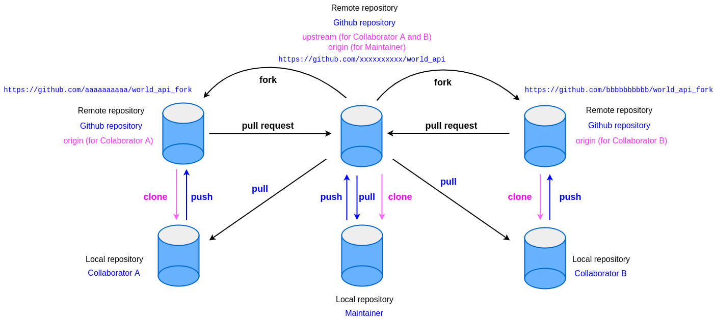
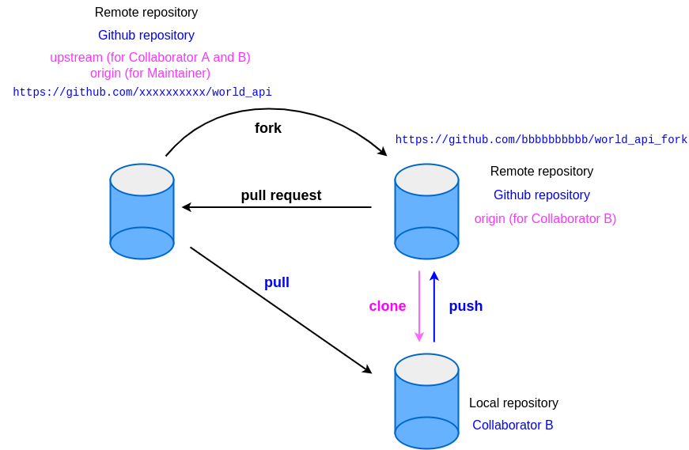

# Task 3_2

## Tasks for Collaborator(s)

### Overview of repositories for team members

<figure style="text-align: center">
   
   <figcaption>Repositories overview</figcaption>
</figure>

### Create a forked repository on GitHub

1. Make sure you have signed in with your GitHub account.

2. Use a browser to open the **maintainer**'s repository, e.g. **`https://github.com/xxxxxxxxxx/world_api`**

3. Create a **fork** of the **maintainer**'s repository.

   For example, for a **collaborator** with username **`aaaaaaaaaa`**:

   Name your new **forked** repository as **`world_api_fork`**.

   Your newly forked repository on GitHub will be: **`https://github.com/aaaaaaaaaa/world_api_fork`**

   Leave the option `Copy the main branch only` to its default (default is checked).

4. Clone the forked repository **`world_api_fork`** to your local machine.

   **RUN:**

   ```console
   cd /d/working/
   git clone https://github.com/aaaaaaaaaa/world_api_fork.git
   ```

5. Check current local branches.

   **RUN:**

   ```console
   cd world_api_fork
   git branch
   ```

   **OUTPUT:**

   ```console
   * main
   ```

6. Check current all branches (local and remote branches).

   **RUN:**

   ```console
   git branch -a
   ```

   **OUTPUT:**

   ```console
   * main
     remotes/origin/HEAD -> origin/main
     remotes/origin/main
   ```

   **NOTE:**

   - option `-a` lists both remote-tracking and local branches

7. Check current all branches (local and remote branches) with more information.

   **RUN:**

   ```console
   git branch -av
   ```

   **OUTPUT:**

   ```console
   * main                0ced441a Initial commit
     remotes/origin/HEAD -> origin/main
     remotes/origin/main 0ced441a Initial commit
   ```

8. Check current all branches (local and remote branches) with more details.

   **RUN:**

   ```console
   git branch -avv
   ```

   **OUTPUT:**

   ```console
   * main                0ced441a [origin/main] Initial commit
     remotes/origin/HEAD -> origin/main
     remotes/origin/main 0ced441a Initial commit
   ```

   **NOTE:**

   - local branch `main` is tracking remote repository `origin` on branch `main`. i.e. remote branch `origin/main`

9. See remote repository `origin`.

   **RUN:**

   ```console
   git remote show origin
   ```

   **OUTPUT:**

   ```console
   * remote origin
     Fetch URL: https://github.com/aaaaaaaaaa/world_api_fork.git
     Push  URL: https://github.com/aaaaaaaaaa/world_api_fork.git
     HEAD branch: main
     Remote branch:
       main tracked
     Local branch configured for 'git pull':
       main merges with remote main
     Local ref configured for 'git push':
       main pushes to main (up to date)
   ```

### Add remote `upstream`

1. Add maintainer's repository as another remote repository with name **`upstream`**.

   The remote maintainer's repository on GitHub **`world_api`** will be called **`upstream`**.

   **RUN:**

   ```console
   git remote add upstream https://github.com/xxxxxxxxxx/world_api.git
   ```

   The above command adds a reference as another remote repository using name **`upstream`**.

2. Check current remote repositories.

   **RUN:**

   ```console
   git remote -v
   ```

   **OUTPUT:**

   ```console
   origin   https://github.com/aaaaaaaaaa/world_api_fork.git (fetch)
   origin   https://github.com/aaaaaaaaaa/world_api_fork.git (push)
   upstream https://github.com/xxxxxxxxxx/world_api.git (fetch)
   upstream https://github.com/xxxxxxxxxx/world_api.git (push)
   ```

3. See remote repository `upstream`.

   **RUN:**

   ```console
   git remote show upstream
   ```

   **OUTPUT:**

   ```console
   * remote upstream
     Fetch URL: https://github.com/xxxxxxxxxx/world_api.git
     Push  URL: https://github.com/xxxxxxxxxx/world_api.git
     HEAD branch: main
     Remote branch:
       main new (next fetch will store in remotes/upstream)
     Local ref configured for 'git push':
       main pushes to main (up to date)
   ```

4. Get any update from **`upstream`**.

   **RUN:**

   ```console
   git fetch upstream
   ```

   **OUTPUT:**

   ```console
   From https://github.com/xxxxxxxxxx/world_api
    * [new branch]        main       -> upstream/main
   ```

5. Check log.

   **RUN:**

   ```console
   git log --oneline --graph --all
   ```

   **OUTPUT:**

   ```console
   * 0ced441a (HEAD -> main, upstream/main, origin/main, origin/HEAD) Initial commit
   ```

### **Collaborator**'s view of repositories

   <figure style="text-align: center">
      
      <figcaption>Collaborator A's view</figcaption>
   </figure>

---

   <figure style="text-align: center">
      
      <figcaption>Collaborator B's view</figcaption>
   </figure>

### Check Point: Task 3_2

#### For Collaborator

In repository **`/d/working/world_api_fork`**, there should be:

- **0 new commit**
- current total commits: **1**
- local branches: **1**
- remote branches: **2**
- remote tracking branch: **1**
